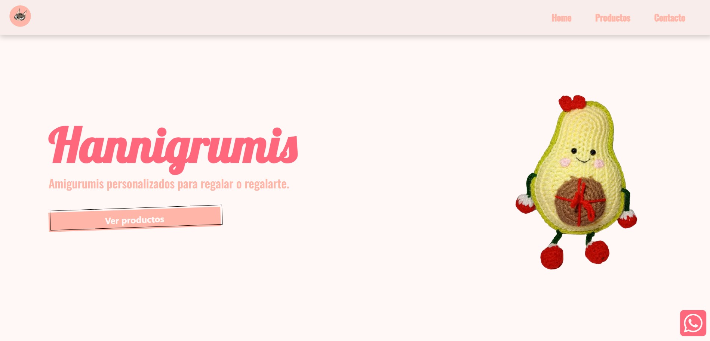
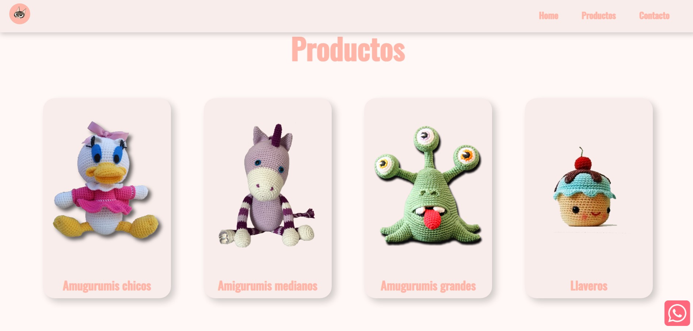
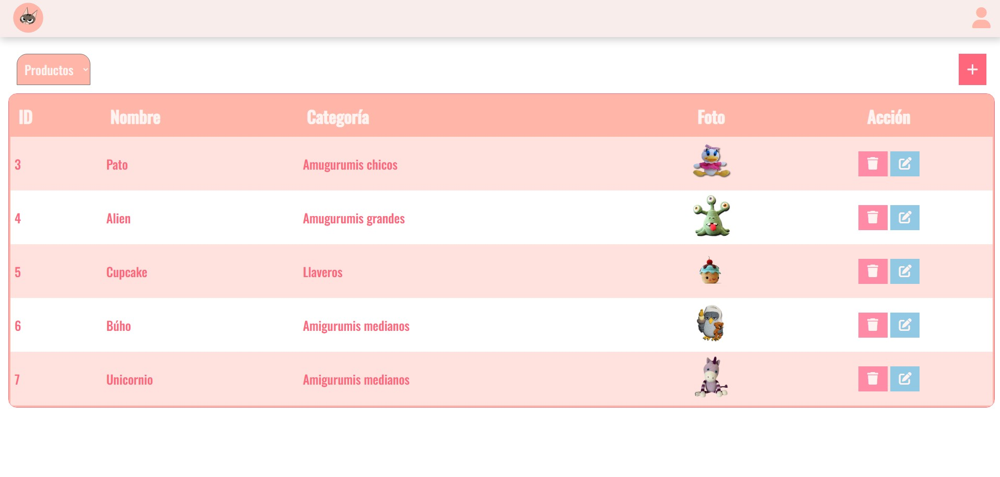

# Hannigrumis

**Hannigrumis** es un pequeño emprendimiento de amigurumis personalizados.
La idea de este proyecto es proveer una plataforma que funcione como portafolio de productos y facilite el contacto con los clientes.

---

## 🛠️ Configuración

Para el correcto funcionamiento, se deben configurar las variables en el archivo `config.js`.

```js
window.env = {
    API_URL : "",              // URL del backend (por ejemplo, http://127.0.0.1:8080/).
    CATEGORY_ROUTE : "category/",
    PRODUCT_ROUTE : "product/",
    IMAGE_ROUTE : "images/",
    LOGIN_ROUTE : "login",
    CHECK_TOKEN_ROUTE : "valid-user",
    RECOVERY_ROUTE : "reset-password",
    CHANGE_PASSWORD_ROUTE : "change-password",
    REGISTER_ROUTE : "register",
    GET_USERS : "get-users",
    EDIT_USER_ROUTE : "edit-user",
    DELETE_USER_ROUTE : "delete-user",
    CONTACT_EMAIL : "",        // Correo electrónico utilizado para el formulario de contacto.
    WHATSAPP : "",             // Número de WhatsApp.
    INSTAGRAM : "",            // Enlace a Instagram.
    FACEBOOK : ""              // Enlace a Facebook.
}
```
---
## 🖼️ Imágenes del Proyecto

### 🏠 Página Principal

**📌 Portada**


**🛍️ Productos**


---

### 🔐 Página de Inicio de Sesión


---

### 🛠️ Panel de Control


